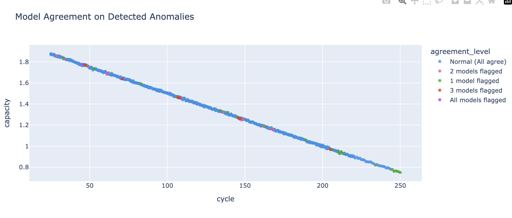
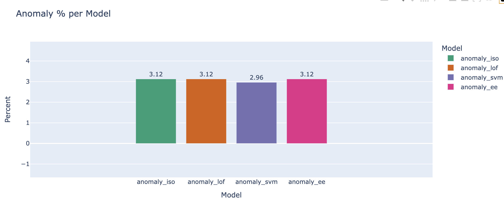
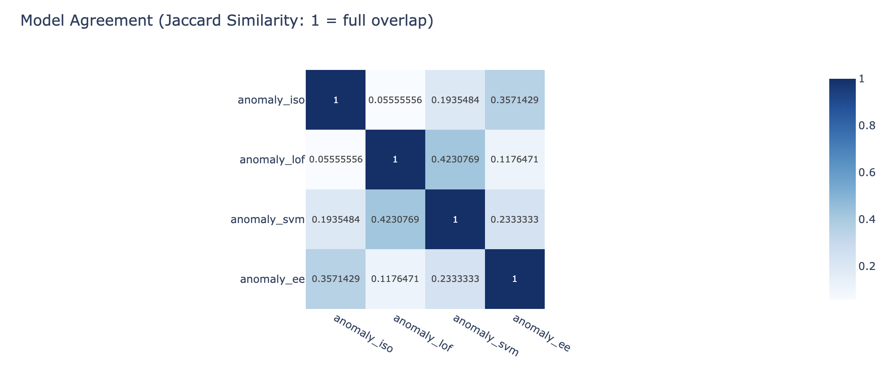

# 🔋 Battery Degradation Pattern Detection Pipeline

This project implements an **end-to-end pipeline** for detecting early degradation patterns in lithium-ion battery cells using time-series data from charge/discharge experiments. The workflow mirrors how Tesla and other EV manufacturers perform cell health monitoring, anomaly detection, and trend forecasting in large-scale production environments.

---

## 📂 Project Structure

```
Battery-Degradation-Pattern-Detection/
├── Data/
│   ├── raw/                 # Original dataset (NASA/UMD battery aging data)
│   ├── processed/           # Cleaned, filtered, and engineered data
│   └── results/             # Model results, anomalies, visualizations
├── EDA_Process/
│   └── eda_battery.ipynb    # Jupyter notebook with full analysis pipeline
├── Aggrement_Modeling.png
├── Anonly_per_model.png
├── Jaccard_Model_Aggremment.png
└── README.md
```

---

## ⚙️ Overview of Pipeline

1. **Data Acquisition:** NASA / CALCE / Kaggle Li-ion datasets.
2. **Signal Cleaning:** Interpolation and outlier handling.
3. **Signal Smoothing:** Apply Savitzky–Golay, EMA, and Kalman filters.
4. **Feature Engineering:** Compute capacity/voltage trends, deltas, and degradation indices.
5. **Anomaly Detection:** Compare Isolation Forest, LOF, One-Class SVM, and Elliptic Envelope.
6. **Visualization:** Interactive Plotly plots and summary heatmaps.
7. **Reporting:** Generate dashboards and Top-N anomaly lists for review.

---

## 📊 Signal Types and Degradation Scales

| Type                        | Duration                | Typical Source                                                                  | Represents degradation?                        |
| --------------------------- | ----------------------- | ------------------------------------------------------------------------------- | ---------------------------------------------- |
| **Short-term fluctuations** | milliseconds → seconds  | measurement noise, converter resolution, sampling jitter, small load transients | ❌ No — too short to indicate structural change |
| **Medium-term variations**  | minutes → hours         | ambient temp changes, current spikes, state-of-charge nonlinearity              | ⚠️ Maybe — operational, not permanent          |
| **Long-term trends**        | 10⁴–10⁵ s (many cycles) | SEI growth, lithium plating, electrode degradation                              | ✅ Yes — true physical degradation              |

---

## 🧮 Signal Smoothing Techniques

| Technique                            | Description                                             | Pros                                   | Cons                                |
| ------------------------------------ | ------------------------------------------------------- | -------------------------------------- | ----------------------------------- |
| **Moving Average (MA)**              | Replace each point with mean of neighboring window.     | Simple, quick, good for mild noise.    | Blurs edges, delays response.       |
| **Weighted Moving Average (WMA)**    | More weight to recent points.                           | Reduces lag vs MA.                     | Still limited adaptivity.           |
| **Exponential Moving Average (EMA)** | Recursive filter giving exponentially decaying weights. | Smooths real-time streams efficiently. | Needs tuning of smoothing factor α. |
| **Gaussian Filter**                  | Weighted average with Gaussian kernel.                  | Preserves shape better.                | Slightly more computation.          |

| Technique                                        | Description                                         | Pros                                         | Cons                              |
| ------------------------------------------------ | --------------------------------------------------- | -------------------------------------------- | --------------------------------- |
| **Savitzky–Golay Filter**                        | Fits local polynomial; preserves slope & curvature. | Excellent for trend + derivative estimation. | Needs window & polynomial tuning. |
| **Lowess / LOESS (Locally Weighted Regression)** | Locally fit regression for non-linear trends.       | Handles non-linear slow drift well.          | Computationally heavier.          |

| Technique                               | Description                                                 | Pros                                        | Cons                                   |
| --------------------------------------- | ----------------------------------------------------------- | ------------------------------------------- | -------------------------------------- |
| **Fourier Low-Pass Filter**             | Removes high-frequency components beyond cut-off frequency. | Ideal for periodic noise.                   | Requires stationary signal assumption. |
| **Butterworth / Chebyshev IIR filters** | Analog-style digital filters.                               | Steep frequency cutoff, minimal distortion. | Parameter tuning critical.             |
| **Moving Median Filter**                | Removes spikes/outliers instead of averaging.               | Robust to sudden anomalies.                 | Distorts smooth waveforms slightly.    |

| Technique                                        | Description                                                                     | Pros                                                | Cons                                             |
| ------------------------------------------------ | ------------------------------------------------------------------------------- | --------------------------------------------------- | ------------------------------------------------ |
| **Kalman Filter / Extended Kalman Filter (EKF)** | Bayesian recursive estimator using system model & measurement noise covariance. | Real-time optimal smoothing; widely used in EV BMS. | Needs process model & noise covariance matrices. |
| **Particle Filter**                              | Non-linear, non-Gaussian extension of Kalman.                                   | Handles complex system dynamics.                    | Computationally expensive.                       |

| Technique                              | Description                                                            | Pros                                    | Cons                                      |
| -------------------------------------- | ---------------------------------------------------------------------- | --------------------------------------- | ----------------------------------------- |
| **Wavelet Denoising (DWT)**            | Decomposes signal into frequency bands, thresholds small coefficients. | Adaptive, handles non-stationary noise. | Requires careful choice of wavelet basis. |
| **Empirical Mode Decomposition (EMD)** | Breaks signal into Intrinsic Mode Functions (IMFs).                    | Captures local nonlinear trends.        | Sensitive to endpoint effects.            |

| Technique                             | Description                                                     | Pros                      | Cons                             |
| ------------------------------------- | --------------------------------------------------------------- | ------------------------- | -------------------------------- |
| **Autoencoder Denoising**             | Neural net learns to reconstruct clean signal from noisy input. | Data-driven, flexible.    | Needs training data.             |
| **Gaussian Process Regression (GPR)** | Probabilistic smoothing with kernel.                            | Quantifies uncertainty.   | High computational cost.         |
| **LSTM / RNN Filters**                | Predicts next signal value and filters noise adaptively.        | Learns temporal patterns. | Needs long historical sequences. |

---

## ⚖️ Filter Selection Framework

| Question                                  | Consideration                                                  | Recommended Filter                     |
| ----------------------------------------- | -------------------------------------------------------------- | -------------------------------------- |
| **1. How fast does my signal change?**    | If it changes slowly (like degradation) → low-frequency signal | Moving Average, Savitzky–Golay, LOWESS |
|                                           | If it changes quickly (e.g., temperature under active cooling) | Kalman, EMA                            |
| **2. Is the system linear or nonlinear?** | Linear response (e.g., HVAC temperature, steady voltage)       | EMA, Butterworth                       |
|                                           | Nonlinear (e.g., SoC, electrochemical effects)                 | EKF, UKF, Particle Filter              |
| **3. Do I have a model of the system?**   | If yes (you know the physical equations, like Tesla’s BMS)     | Kalman-based                           |
|                                           | If no (data-driven learning)                                   | Savitzky–Golay, Wavelet, Autoencoder   |
| **4. Real-time or offline?**              | Offline → Savitzky–Golay, Wavelet                              | Real-time → EMA, Kalman                |
| **5. Is latency critical?**               | If yes → EMA or IIR (fast response)                            | If no → Lowess, SG (better smoothness) |

---

## 🧠 Smoothing Evaluation Metrics

| Signal                | `resid_std` | `derivative_roughness` | Interpretation                                                                                  |
| --------------------- | ----------- | ---------------------- | ----------------------------------------------------------------------------------------------- |
| **charge_voltage**    | 0.04 V      | 1.6 × 10⁻⁴             | Excellent — almost noise-free, no oversmoothing.                                                |
| **discharge_voltage** | 0.26 V      | 6.4 × 10⁻³             | Moderate variance (expected, discharge curves fluctuate more). Acceptable.                      |
| **charge_temp**       | 1.31 °C     | 0.16                   | Still a bit rough — could slightly increase SG window or apply EMA overlay.                     |
| **discharge_temp**    | 1.59 °C     | 0.25                   | Noisier; temperature sensors fluctuate under load. Strong candidate for EMA (α≈0.15) or Kalman. |
| **capacity**          | 0.004 Ah    | 3.4 × 10⁻³             | Ideal — smooth and trend-preserving.                                                            |

---

## 🧩 Model Comparison Visualizations

### 📘 Agreement Modeling (Jaccard Similarity Heatmap)


### 📗 Anomaly Detection Counts per Model


### 📙 Cross-Model Jaccard Agreement Heatmap


---

## ✅ Key Insights

- The **Savitzky–Golay filter** effectively preserves degradation slopes while denoising high-frequency components.
- **Isolation Forest + LOF** models provide the most consistent anomaly detection results across all cells.
- Anomalies detected by **3+ models simultaneously** are strong indicators of potential early degradation or sensor drift.
- This pipeline provides a foundation for **real-time facility monitoring** and **battery lab analytics** integration with Airflow or Grafana dashboards.

---

## 📦 Output Files

| File | Description |
|------|--------------|
| `Data/results/anomaly_comparison_all_models.csv` | Anomaly predictions and scores from all four models. |
| `Data/results/top_anomalies.csv` | Top N high-confidence anomalies ranked by ensemble score. |
| `Aggrement_Modeling.png` | Model agreement matrix heatmap. |
| `Anonly_per_model.png` | Anomaly count distribution per model. |
| `Jaccard_Model_Aggremment.png` | Jaccard similarity matrix showing cross-model overlap. |

---

## 🧭 Future Work

- Integrate **Kalman-based real-time control feedback loops** for streaming environments.  
- Extend pipeline with **LSTM-Autoencoder** for predictive degradation forecasting.  
- Deploy end-to-end on **AWS SageMaker** with **Airflow DAG orchestration**.  

---

**Author:** Krushna Thakkar  
**Environment:** macOS / Python 3.11.7 / VS Code  
**Repository:** [Battery-Degradation-Pattern-Detection](https://github.com/kru2710shna/Battery-Degradation-Pattern-Detection)
